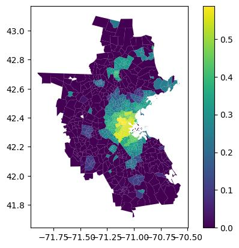
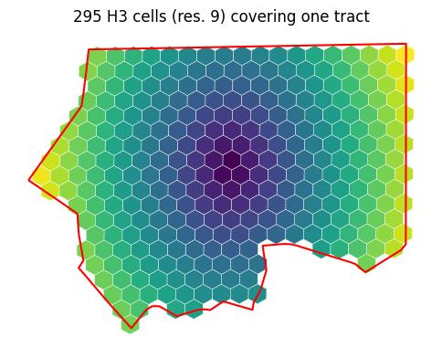
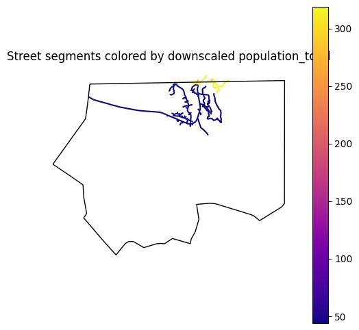
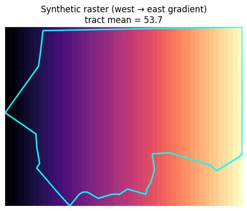

# geohierarchy

`geohierarchy` manages a **graph of spatial levels** (e.g. county → tract →
block group → block, or any other set of nested or overlapping geometries)
and automatically fills in shared attribute columns across every level,
using the correct spatial resampling strategy in each direction.

## Core concepts

- **Level** — a named layer with its own geometry (polygons, lines, points,
  H3 cells, ...) and attribute table, added with `add_level`.
- **Graph** — levels are wired together with `parent=`/`child=`. A level can
  have any number of parents and children, so the graph can branch and
  merge — it does not have to be a tree.
- **Aggregation strategy** — describes how a column resamples in both
  directions: *upscale* (many fine rows → one coarse row, e.g. `Sum`,
  `Mean`, `Max`, `Min`) and *downscale* (one coarse row → many fine rows,
  e.g. splitting a `Sum` proportionally, or broadcasting a weighted
  `Mean`).
- **Propagation** — fills in every propagatable column at every level it's
  missing from. A level's own native values (set at `add_level` time or
  injected later) are **never overwritten**. This happens **automatically**:
  `add_level`, `set_aggregation`, `add_vector_data`, `add_raster_data`,
  `exclude_column`, and `include_column` all call `propagate()` for you
  after they change anything that could affect it, so there's normally no
  need to call it yourself (it stays available for explicit/idempotent use,
  e.g. after mutating `hierarchy.levels[...]` directly).
- **Non-layer data** — `add_vector_data` / `add_raster_data` bring in an
  external GeoDataFrame or raster as a one-off source of columns for a
  single level, without adding it to the hierarchy graph.

## Quickstart

```python
from geohierarchy import GeoHierarchy, Sum, Mean

gh = GeoHierarchy(crs="EPSG:4326")

gh.add_level("county", county_gdf, id_col="GEOID", agg=Sum())
gh.add_level("tract", tract_gdf, id_col="GEOID", agg=Sum(), parent="county")
gh.add_level("block", block_gdf, id_col="GEOID", agg=Sum(), parent="tract")

# Bring in an outside dataset that isn't part of the hierarchy.
gh.add_vector_data(streets_gdf, level="tract", agg=Mean(weight_column="population_total"))

gh["tract"]   # GeoDataFrame: geometry + every column, filled in at every level -- no propagate() call needed
```

## API reference

### `GeoHierarchy(crs="EPSG:4326")`

Creates an empty hierarchy. Every level's geometry is reprojected to `crs`.

### `add_level(name, gdf, id_col=None, agg=None, parent=None, child=None, geoweight_by=None)`

Registers a level.

| Argument | Meaning |
|---|---|
| `name` | Unique level name. |
| `gdf` | Source geometries + attribute columns. |
| `id_col` | Existing unique-id column in `gdf`. Auto-generated if omitted. |
| `agg` | An `AggregationStrategy`, or `{column: strategy}`, applied to every propagatable column in `gdf`. Can be left `None` if strategies are registered separately with `set_aggregation`. |
| `parent` / `child` | A level name or list of names to link into the graph. Either side may have any number of links. |
| `geoweight_by` | `"area"` or `"length"`, used to weight spatial overlaps when this level is a source. Auto-detected from geometry type. |

Geometry-derived columns (`area`, `length`, bounds, centroid, geometry
type) are computed automatically and never propagate. `propagate()` runs
automatically at the end of this call -- if `parent`/`child` connects this
level to levels that already hold propagated (non-native) values, those
are dropped and recomputed first, since the new edge might now offer a
higher-priority (child) source for them.

### `set_aggregation(column, agg=None, level=None, *, upscale=None, downscale=None)`

The single place aggregation strategies are registered or changed:

- `set_aggregation("population", Sum())` — default for that column everywhere.
- `set_aggregation(None, Sum(), level="block")` — default for every column native to `"block"`.
- `set_aggregation("population", Max(), level="block")` — overrides the column default, but only when propagating *from* `"block"`.
- `set_aggregation("income", upscale=Mean(weight_column="population"), downscale=Max())` — different
  behavior for each direction, instead of a single `agg` used both ways.

Changing a column's (or level's) strategy invalidates any values already
derived from it and immediately calls `propagate()`, which recomputes them
with the new rule instead of leaving stale values behind. (The one case
this is skipped is registering a strategy for a column that doesn't exist
at any level yet -- nothing to propagate until it does.)

### `exclude_column(column)` / `include_column(column)`

Control which columns `propagate()` actually considers — the "propagation
column list" — independently of registering an aggregation strategy:

- `exclude_column("internal_notes")` — opts a column out. Its native
  values (wherever it was originally set) are kept, but any copies it
  had picked up at other levels are deleted immediately, and future
  propagation skips it — no aggregation strategy is required for an
  excluded column.
- `include_column("internal_notes")` — re-enables it and immediately
  fills it in everywhere again (a strategy must already be registered for
  that to succeed).
- `hierarchy.propagation_columns` — read-only set of columns currently
  eligible for propagation, i.e. every registered column minus geometry
  metadata/id columns and anything excluded.

### `propagate()`

Fills every propagatable column into every level it's missing from. Called
automatically by every method above -- see "Core concepts" -- so it's
rarely called directly. The one time you need it yourself is after
mutating `hierarchy.levels[name]` in place, which bypasses the column
registry entirely.

- **Upscaling**: a level's data is aggregated into its parent(s).
- **Downscaling**: a level's data is disaggregated into its child(ren).
- The upscale pass always finishes before the downscale pass starts, so
  **if a level could get a column from either a child or a parent, the
  child wins**.
- Native values are never overwritten. Calling `propagate()` repeatedly is
  a no-op once every level is filled.
- Never raises for a missing aggregation strategy: a column that needs one
  to cross an edge is skipped (left missing at the levels it couldn't
  reach) and a `UserWarning` is emitted pointing at `set_aggregation()`,
  so one column with no strategy yet can't block unrelated changes
  elsewhere in the hierarchy -- important since propagation now runs
  automatically after nearly every call.

### `add_vector_data(gdf, level, columns=None, agg=None, geoweight_by=None, upscale=None, buffer=0, fill_null=0)`

Injects columns from an external GeoDataFrame into one level, without
adding it to the graph. Direction (`upscale`) is auto-detected by comparing
typical geometry sizes unless given explicitly. `agg` is also registered
for the column going forward, so `propagate()` knows how to move it to
every other level afterward.

### `add_raster_data(raster, column, level, agg=None, upscale=True, transform=None, crs=None)`

Same idea as `add_vector_data`, but the source is a raster (file path or
in-memory array); it's vectorized to pixel-centroid points first.

### `get_level(name)` / `hierarchy[name]`

Returns a level's geometry joined with its full attribute table, as a
GeoDataFrame.

## Aggregation strategies (`geohierarchy.aggregation`)

| Strategy | Use for | Upscale | Downscale |
|---|---|---|---|
| `Sum()` | Additive counts (population, vehicles) | Sum, optionally weighted | Proportional split |
| `Mean()` | Rates, scores, prices | (Weighted) average | Broadcast if weighted, otherwise left for the caller |
| `Max()` / `Min()` | Extremes | Max / min | Not defined (no meaningful split) |

Any strategy can be made `geoweighted=True` to additionally weight rows by
their fraction of geometric overlap (area or length) with the destination
geometry — the right choice whenever geometries don't align exactly.

`aggregation_strategy(upscale, downscale)` combines one strategy's upscale
behavior with another's downscale behavior, for the rare case where they
need to differ.

When a destination geometry overlaps more than one source row during a
downscale (e.g. a street crossing two tracts), each strategy decides how
to combine the resulting fragments via `consolidate_downscale`: `Sum`
adds them (so the total is still conserved), `Max`/`Min` take the
max/min, and everything else (including `Mean`) just keeps one -- correct
by construction, since a broadcast value is identical across fragments.

## Working with non-polygon and H3 layers

Any level's geometry can be polygons, lines, points, or H3 cells -- the
graph, propagation, and aggregation logic don't care, only `geoweight_by`
(`"area"` vs `"length"`) changes based on geometry type, and it's
auto-detected.

- `h3_cells(geometry, resolution)` vectorizes an H3 grid covering
  `geometry` into ordinary polygons (an `"h3"` id column + geometry), so
  the result works directly with `add_level` as a core layer, or with
  `add_vector_data`/`add_raster_data` as non-layer source data.
- A LineString level (e.g. street segments) can sit anywhere in the graph
  -- as a child receiving disaggregated polygon data, or as a source
  whose own columns upscale into a polygon parent.
- Real-world id columns are not always clean: some GIS exports (OSM
  street graphs in particular) have duplicate or list-valued id columns.
  Prefer leaving `id_col=None` (an auto-generated positional id) unless
  the source column is a genuine unique key.

## Non-linear graphs

A level is not limited to one parent and one child:

```python
gh.add_level("cells", cells_gdf, id_col="id", agg=Sum(), parent=["region_a", "region_b"])
```

Here `cells` feeds two unrelated parents — a column summed at `cells`
correctly reaches both `region_a` and `region_b`.

## Walkthrough: geohierarchy in 5 steps (plus H3, LineString, and raster layers)

This section is the literal, executed content of
[`examples/geohierarchy_walkthrough.ipynb`](examples/geohierarchy_walkthrough.ipynb)
against the real fixtures in `tests/test_files/` -- same code, same
outputs, same plots, not retyped by hand. Regenerate it after editing the
notebook with:

```bash
jupyter nbconvert --to markdown examples/geohierarchy_walkthrough.ipynb \
    --output-dir examples --output geohierarchy_walkthrough
```

then paste the resulting `examples/geohierarchy_walkthrough.md` back into
this section, prefixing image paths with `examples/`.

---

A `GeoHierarchy` is a graph of spatial levels (county → tract → block) that
automatically fills in shared columns everywhere, using the right spatial
resampling in each direction. `propagate()` runs **automatically** after
`add_level`, `add_vector_data`, `add_raster_data`, and `set_aggregation` --
you never have to call it yourself. See `docs.md` for the full reference.


### 1. Load some nested geographies


```python
from pathlib import Path
import geopandas as gpd
import matplotlib.pyplot as plt
from matplotlib_inline.backend_inline import set_matplotlib_formats
from geohierarchy import GeoHierarchy, Sum, Mean

set_matplotlib_formats("jpeg")  # smaller than PNG; fine since these plots have no transparency

files = Path("../tests/test_files")
county = gpd.read_file(files / "county.gpkg")
tract = gpd.read_file(files / "tract.gpkg")
block = gpd.read_file(files / "block.gpkg")
streets = gpd.read_file(files / "accessibility_place.gpkg")
```

### 2. Build the hierarchy

`add_level` registers a layer, `id_col` names its unique id, `agg` says how
its columns aggregate upward, and `parent` wires it into the graph. Each
call already fills in every level it can -- `block` gets no
`population_total` of its own, but immediately picks one up by
disaggregating `tract`'s values. Levels that already have real data are
never overwritten.


```python
gh = GeoHierarchy()

gh.add_level("county", county[["GEOID", "population_total", "geometry"]], id_col="GEOID", agg=Sum())
gh.add_level("tract", tract[["GEOID", "population_total", "geometry"]], id_col="GEOID", agg=Sum(), parent="county")
gh.add_level("block", block[["GEOID", "geometry"]], id_col="GEOID", parent="tract")

gh.levels["block"]["population_total"].sum(), gh.levels["county"]["population_total"].sum()

```


    (4865033.000000001, 7335732)


### 3. Bring in outside data

`add_vector_data` injects columns from any GeoDataFrame into one level --
it doesn't join the hierarchy graph. Here we add an `accessibility` score
at the `tract` level, weighted by population; it's spread to every other
level as soon as the call returns.


```python
gh.add_vector_data(
    streets[["accessibility", "population_total", "geometry"]],
    level="tract",
    columns="accessibility",
    agg=Mean(weight_column="population_total"),
)

gh.levels["county"]["accessibility"].describe()

```


<div><style>
.dataframe > thead > tr,
.dataframe > tbody > tr {
  text-align: right;
  white-space: pre-wrap;
}
</style>
<small>shape: (9, 2)</small><table border="1" class="dataframe"><thead><tr><th>statistic</th><th>value</th></tr><tr><td>str</td><td>f64</td></tr></thead><tbody><tr><td>&quot;count&quot;</td><td>10.0</td></tr><tr><td>&quot;null_count&quot;</td><td>0.0</td></tr><tr><td>&quot;mean&quot;</td><td>0.135362</td></tr><tr><td>&quot;std&quot;</td><td>0.178235</td></tr><tr><td>&quot;min&quot;</td><td>0.0</td></tr><tr><td>&quot;25%&quot;</td><td>0.0</td></tr><tr><td>&quot;50%&quot;</td><td>0.078109</td></tr><tr><td>&quot;75%&quot;</td><td>0.234849</td></tr><tr><td>&quot;max&quot;</td><td>0.542209</td></tr></tbody></table></div>


### 4. Read a level back out


```python
gh["tract"].plot(column="accessibility", legend=True)

```


    <Axes: >





## H3 and LineString layers, and synthetic rasters

Everything so far used polygon layers, but a level's geometry can be
anything -- H3 cells, linestrings, points. The examples below build on
the `tract` level from step 2.


### H3 cells as a core layer

`h3_cells(geometry, resolution)` vectorizes an H3 grid into ordinary
polygons, so it works with `add_level` exactly like any other layer.


```python
from geohierarchy import h3_cells

one_tract = gh["tract"].iloc[[0]]
h3_grid = h3_cells(one_tract, resolution=9)
h3_grid["visits"] = 1  # one synthetic visit per cell, just to sum something

gh.add_level("h3", h3_grid, id_col="h3", agg=Sum(), parent="tract")

n_cells = len(h3_grid)
tract_total = gh.levels["tract"]["visits"].sum()
n_cells, tract_total

h3_grid["distance_to_centroid"] = h3_grid.geometry.centroid.distance(
    one_tract.geometry.iloc[0].centroid
)

```

    /tmp/ipykernel_332634/1671461491.py:13: UserWarning: Geometry is in a geographic CRS. Results from 'centroid' are likely incorrect. Use 'GeoSeries.to_crs()' to re-project geometries to a projected CRS before this operation.

      h3_grid["distance_to_centroid"] = h3_grid.geometry.centroid.distance(
    /tmp/ipykernel_332634/1671461491.py:13: UserWarning: Geometry is in a geographic CRS. Results from 'distance' are likely incorrect. Use 'GeoSeries.to_crs()' to re-project geometries to a projected CRS before this operation.

      h3_grid["distance_to_centroid"] = h3_grid.geometry.centroid.distance(


```python
fig, ax = plt.subplots(figsize=(6, 6))
h3_grid.plot(column="distance_to_centroid", cmap="viridis", ax=ax, edgecolor="white", linewidth=0.3)
one_tract.boundary.plot(ax=ax, color="red", linewidth=1.5)
ax.set_title(f"{n_cells} H3 cells (res. 9) covering one tract")
ax.set_axis_off()
```





### A LineString layer (streets) as a child of a polygon layer

Streets clipped to that same tract, added as their own level -- `tract`'s
`population_total` immediately splits across them, length-weighted.


```python
bbox = tuple(one_tract.to_crs(32619).total_bounds)
streets = gpd.read_file(files / "accessibility_streets.gpkg", bbox=bbox)

# osmid isn't a clean unique id in this OSM export (some rows hold a list
# of ids), so let add_level generate a plain positional id instead.
gh.add_level("streets", streets[["geometry"]], parent="tract")
gh.set_aggregation("population_total", Sum(geoweighted=True))

gh.levels["streets"]["population_total"].describe()
```


<div><style>
.dataframe > thead > tr,
.dataframe > tbody > tr {
  text-align: right;
  white-space: pre-wrap;
}
</style>
<small>shape: (9, 2)</small><table border="1" class="dataframe"><thead><tr><th>statistic</th><th>value</th></tr><tr><td>str</td><td>f64</td></tr></thead><tbody><tr><td>&quot;count&quot;</td><td>109.0</td></tr><tr><td>&quot;null_count&quot;</td><td>0.0</td></tr><tr><td>&quot;mean&quot;</td><td>71.018349</td></tr><tr><td>&quot;std&quot;</td><td>80.863349</td></tr><tr><td>&quot;min&quot;</td><td>44.11215</td></tr><tr><td>&quot;25%&quot;</td><td>44.11215</td></tr><tr><td>&quot;50%&quot;</td><td>44.11215</td></tr><tr><td>&quot;75%&quot;</td><td>44.11215</td></tr><tr><td>&quot;max&quot;</td><td>318.748513</td></tr></tbody></table></div>


```python
fig, ax = plt.subplots(figsize=(6, 6))
gh["streets"].plot(column="population_total", cmap="plasma", legend=True, ax=ax, linewidth=1.5)
one_tract.boundary.plot(ax=ax, color="black", linewidth=1)
ax.set_title("Street segments colored by downscaled population_total")
ax.set_axis_off()
```





### A synthetic raster

Any 2D array with an affine transform works -- here a made-up gradient
raster stands in for something like elevation or temperature.


```python
import numpy as np
from affine import Affine

minx, miny, maxx, maxy = one_tract.total_bounds
size = 50
gradient = np.linspace(0, 100, size, dtype="float32")
synthetic = np.tile(gradient, (size, 1))  # increases west -> east
transform = Affine.translation(minx, maxy) * Affine.scale(
    (maxx - minx) / size, -(maxy - miny) / size
)

gh.add_raster_data(
    raster=synthetic,
    column="synthetic_index",
    level="tract",
    agg=Mean(),
    transform=transform,
    crs=4326,
)

gh.levels["tract"].filter(
    gh.levels["tract"]["_tract_GEOID"] == one_tract["_tract_GEOID"].iloc[0]
)["synthetic_index"][0]

```


    53.66289138793945


```python
fig, ax = plt.subplots(figsize=(6, 6))

ax.imshow(synthetic, cmap="magma", extent=(minx, maxx, miny, maxy))
one_tract.boundary.plot(ax=ax, color="cyan", linewidth=2)

tract_mean = gh.levels["tract"].filter(
    gh.levels["tract"]["_tract_GEOID"] == one_tract["_tract_GEOID"].iloc[0]
)["synthetic_index"][0]
ax.set_title(f"Synthetic raster (west \u2192 east gradient)\ntract mean = {tract_mean:.1f}")
ax.set_axis_off()
```





## More examples

Open [`examples/geohierarchy_walkthrough.ipynb`](examples/geohierarchy_walkthrough.ipynb)
directly to run it interactively.
